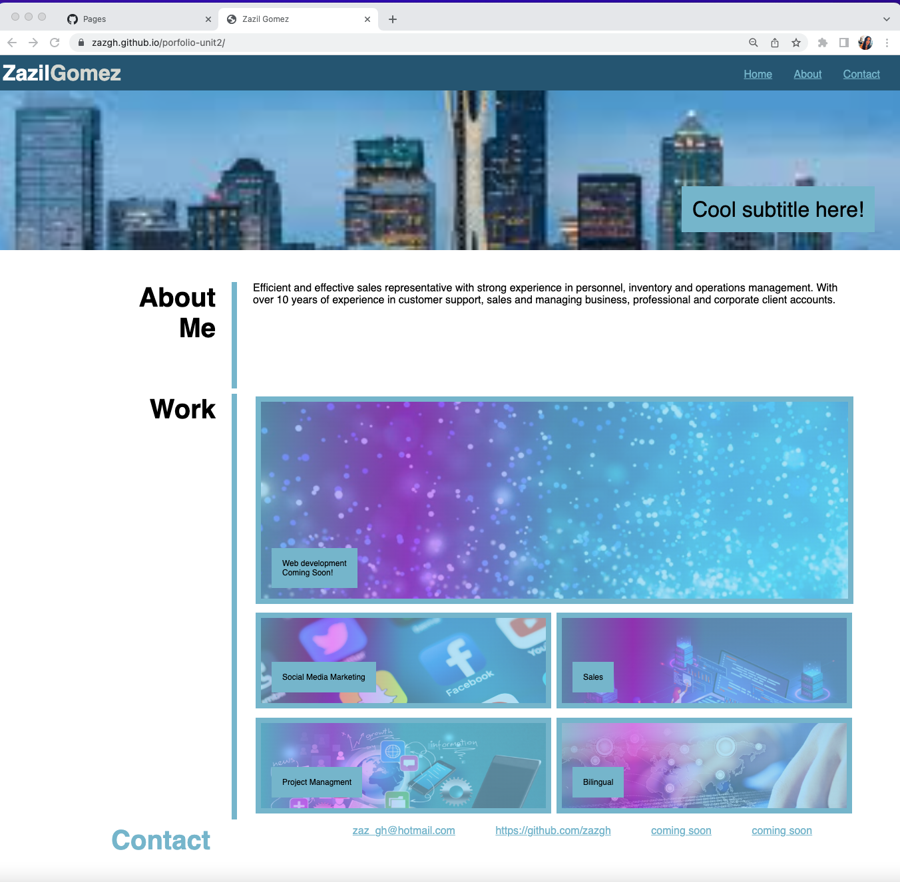

# 02 Advanced CSS: Portfolio

A portfolio of work can showcase your skills and talents to employers looking to fill a part-time or full-time position.
An effective portfolio highlights your strongest work as well as the thought processes behind it. Students who have portfolios with deployed web applications (meaning they are live on the web) are typically very successful in their career search after the boot camp. This last point can’t be stressed enough: having several deployed projects is a minimum requirement to receive an initial interview at many companies.

## User Story
AS AN employer
I WANT to view a potential employee's deployed portfolio of work samples
SO THAT I can review samples of their work and assess whether they're a good candidate for an open position

## Acceptance Criteria
It's done when it's given a sample of a potential employee's previous work
It's done when I load their portfolio
It's done when it's presented with the developer's name, and links to sections about them, their work, and how to contact them
It's done when I click one of the links in the navigation
It's done when the UI scrolls to the corresponding section
It's done when I click on the link to the section about their work
It's done when I click on the images of the applications
It's done when I am taken to that deployed application
It's done when I resize the page or view the site on various screens and devices
It's done when I am presented with a responsive layout that adapts to my viewport

## Mock-Up
